# 📅 Leave Management System (LMS)

A robust, full-stack multi-role web application designed to streamline leave requests, approvals, and faculty tracking. Built with the **MERN** stack (MongoDB, Express, React, Node.js), this system ensures a seamless experience for educational institutions or corporate departments.

---

## 🚀 Key Features

The system is tailored for three specific user roles, each with a dedicated dashboard and protected access:

### 👨‍💼 For Admin
* **User Management:** Oversee all accounts, verify faculty, and manage system access.
* **System Messaging:** View and manage administrative messages, inquiries, and logs.
* **System Oversight:** High-level view of departmental leave trends and analytics.

### 🎓 For HOD (Head of Department)
* **Leave Approval Workflow:** Review, approve, or reject leave applications from faculty in real-time.
* **Notice Board:** Create, update, and manage departmental notices for all staff.
* **Staff Profiles:** Access detailed profiles, timetables, and leave history of faculty members.

### 🏫 For Faculty
* **Leave Application:** Apply for various leave types via an intuitive interface with date-picking capabilities.
* **Status Tracking:** Real-time dashboard to track current leave status (Pending/Approved/Rejected).
* **Profile Management:** Update personal details, view individual leave balances, and manage professional information.

---

## 🛠️ Tech Stack

### Frontend
* **Framework:** React 19 + Vite
* **Styling:** Tailwind CSS + shadcn/ui
* **Animations:** Framer Motion
* **Charts:** Recharts & Chart.js
* **Icons:** Lucide React & Iconscout Unicons

### Backend
* **Server:** Node.js + Express.js
* **Database:** MongoDB via Mongoose
* **Security:** JWT (JSON Web Tokens) & BcryptJS (Password Hashing)
* **Communication:** Nodemailer (Email OTP Verification & Notifications)

---
---

## 📸 Application Screenshots

### 🏠 Landing Page
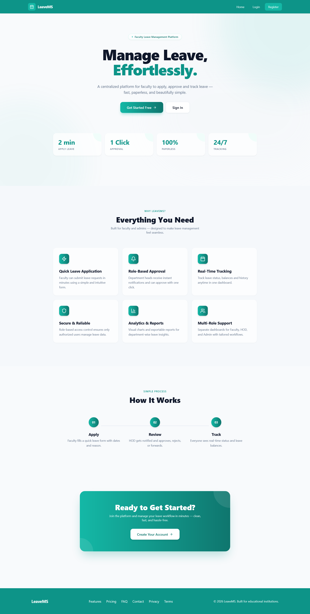

### 🔐 Login Page
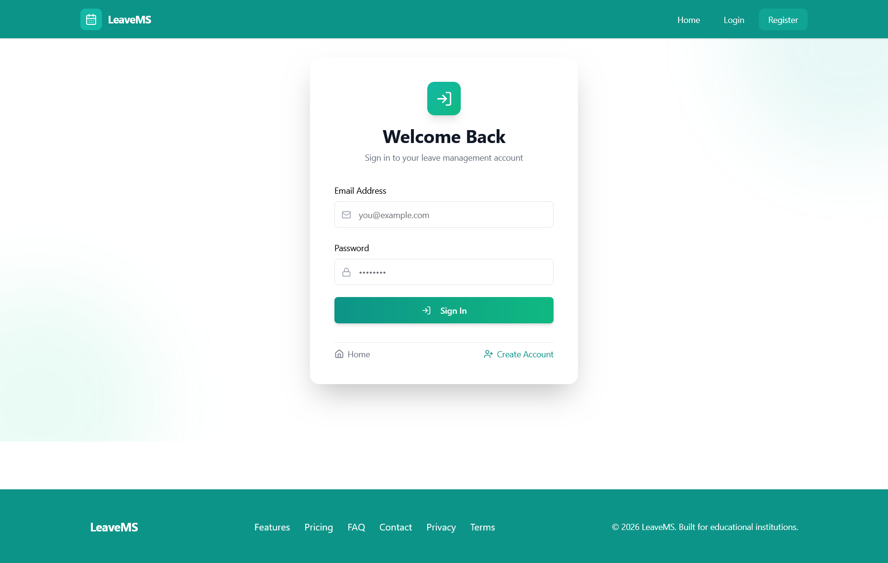

### 📝 Register Page
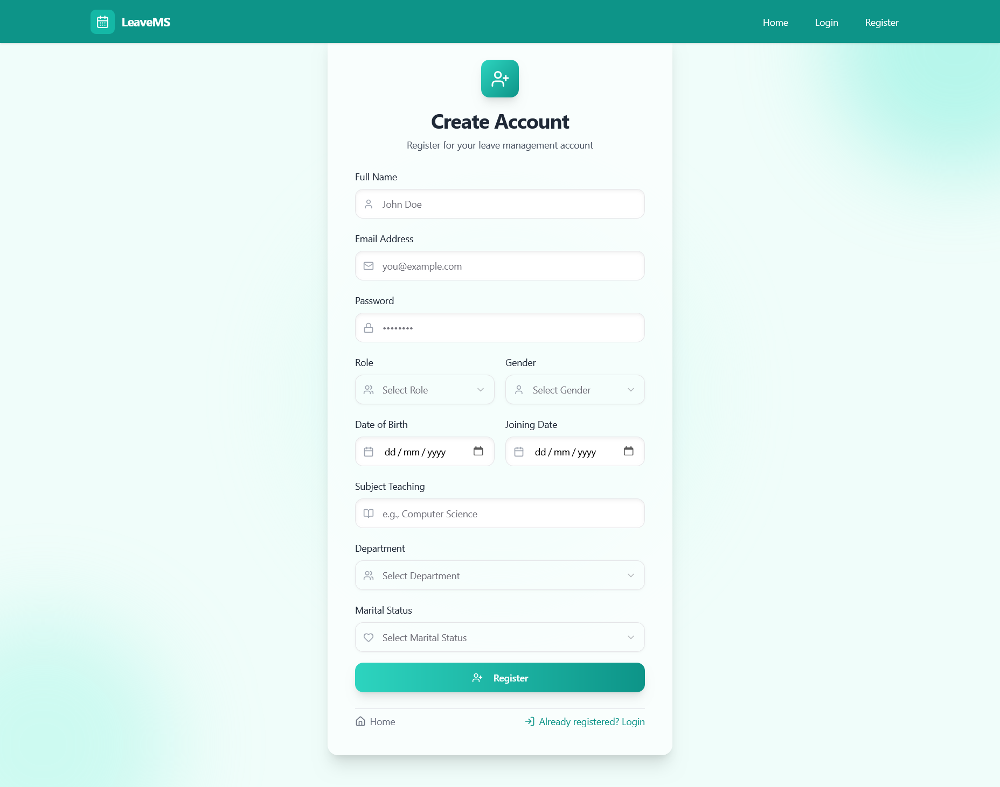

### 📝 OTP-Validation Page


### 👩‍🏫 Faculty Dashboard


### 👤 Faculty Profile


### 📅 Faculty Timetable
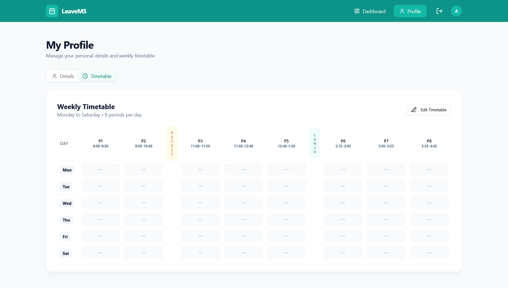

### 🔄 Substitution Request
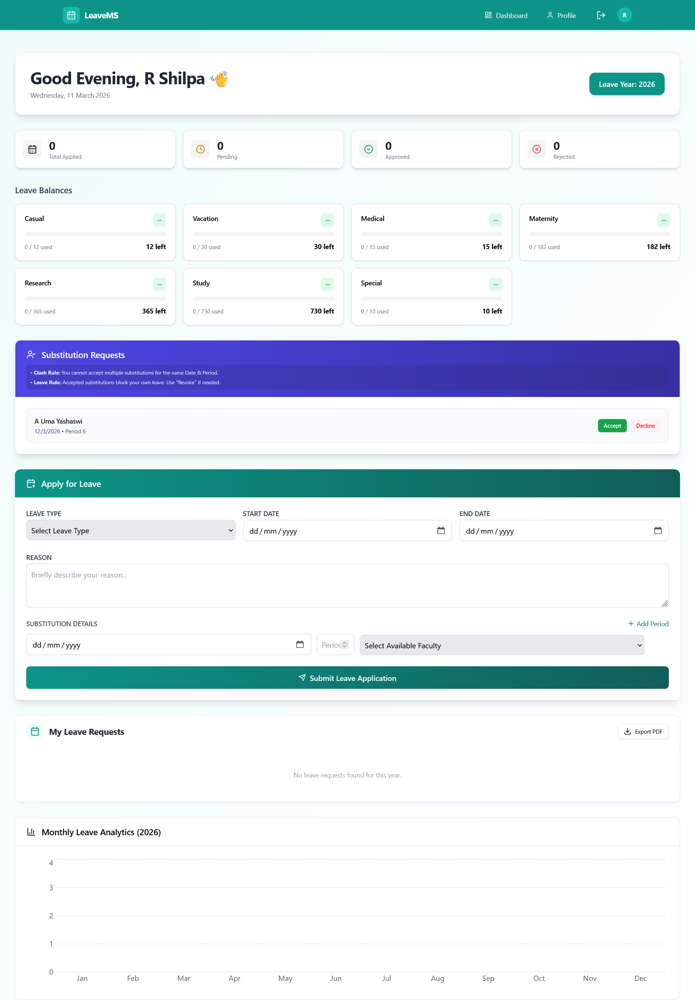

### 👨‍💼 HOD Dashboard
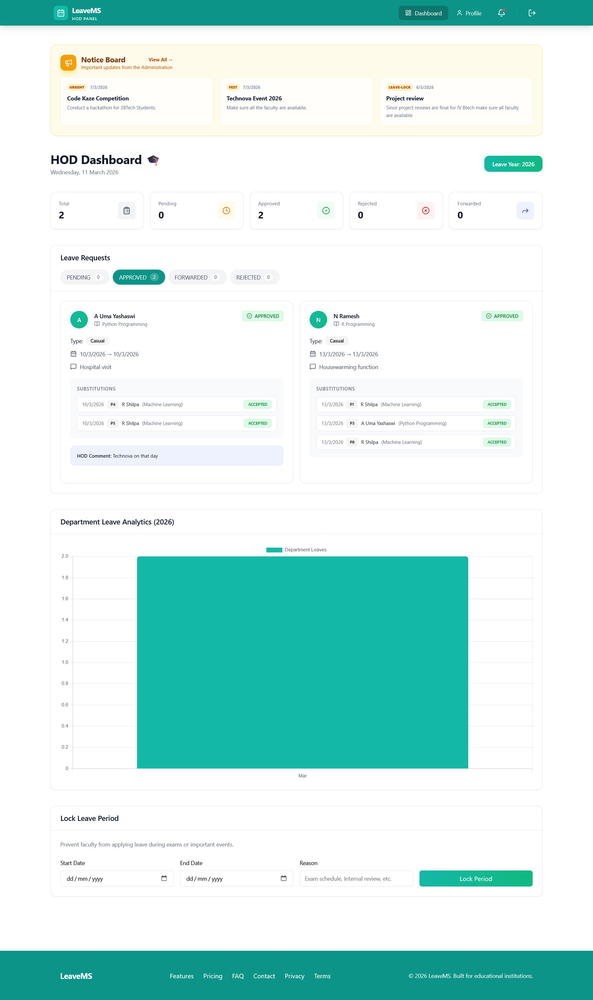

### 👤 HOD Profile
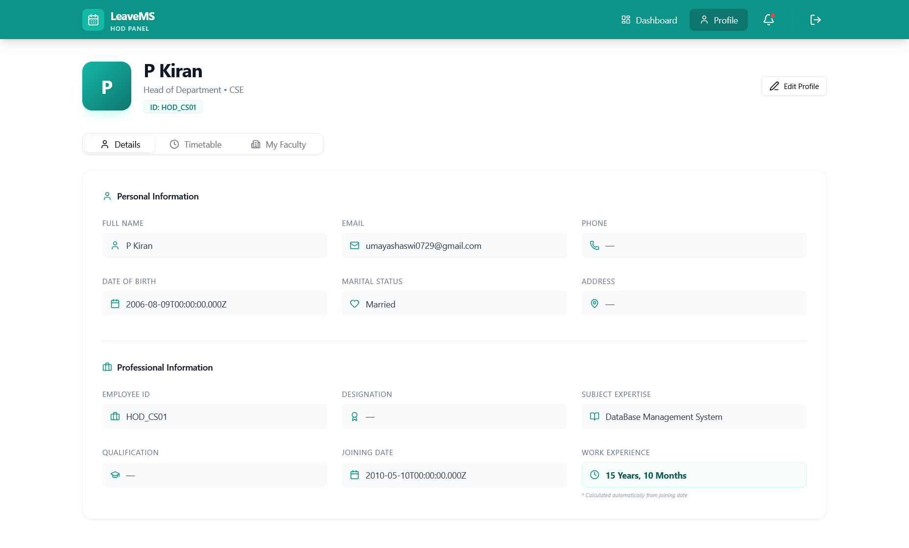

### 📢 HOD Notifications
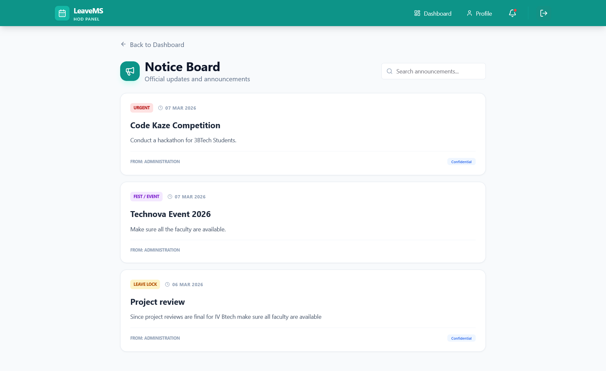

### 👨‍🏫 HOD View Faculty
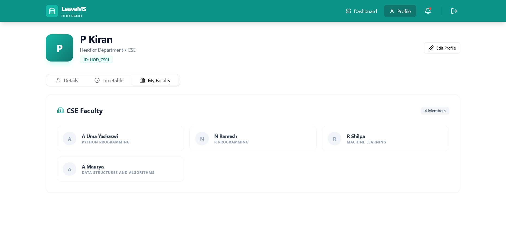

### 🧑‍💻 Admin Dashboard
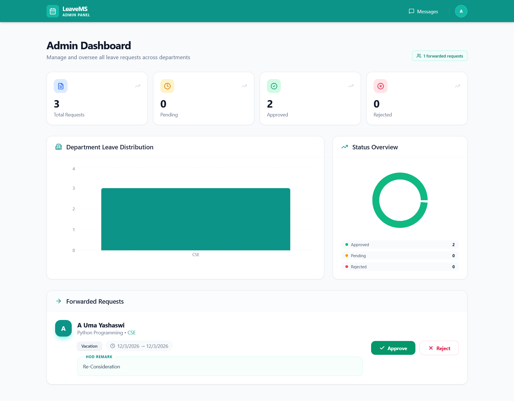

### ✉️ Admin Create Message
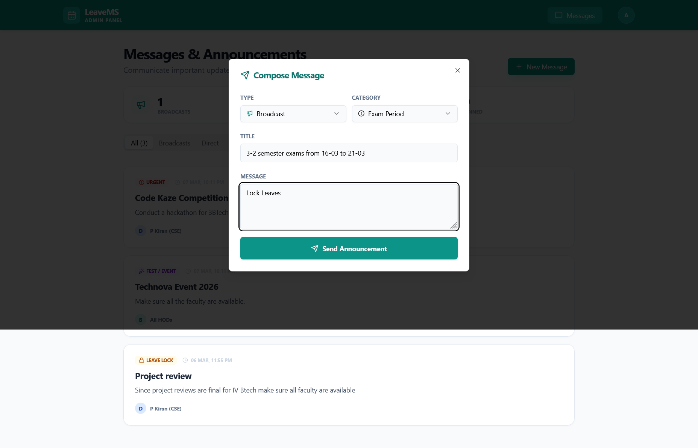

### 💬 Admin Message Center
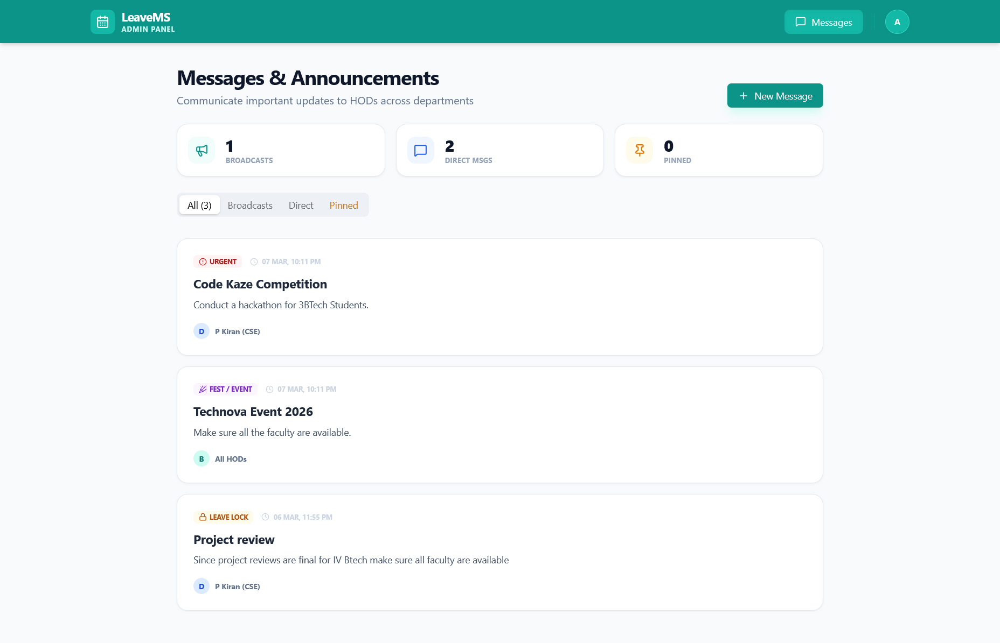
## 🚦 Getting Started

Follow these instructions to get a copy of the project up and running on your local machine.

### Prerequisites
* [Node.js](https://nodejs.org/) installed
* [MongoDB Atlas](https://www.mongodb.com/cloud/atlas) account or local MongoDB instance

### 1. Clone the Repository
```bash
git clone <your-repo-url>
cd leave-management-system
```

### 2. Backend Configuration
Navigate to the backend directory:

```Bash
cd backend
Install dependencies: 
```
```Bash
npm install
Create a .env file in the backend root and add your credentials:

Code snippet
PORT=5000
MONGO_URI=your_mongodb_connection_string
JWT_SECRET=your_secret_key
EMAIL_USER=your_email@example.com
EMAIL_PASS=your_app_specific_password
Start the backend server:
```
```Bash
npm run dev
```
### 3. Frontend Configuration
Open a new terminal and navigate to the frontend directory:

```Bash
cd frontend
Install dependencies:
```
```Bash
npm install
Start the development server:
```
```Bash
npm run dev
The app will typically run on http://localhost:5173.
```

## Project Structure

```bash
leave-management-system/
├── backend/
│ ├── config/ # Database connection
│ ├── controllers/ # Business logic
│ ├── models/ # Mongoose schemas (User, Leave, etc.)
│ ├── routes/ # API endpoints
│ ├── middleware/ # Auth & Role protection
│ └── server.js # Entry point
└── frontend/
├── src/
│ ├── components/ # Reusable UI & Protected Routes
│ ├── pages/ # Role-based Dashboard views
│ ├── styles/ # Global & library-specific CSS
│ └── App.jsx # Routing & App logic
└── tailwind.config.js
```
### 🔐 Security & Role-Based Access
JWT Authentication: Users receive a token upon login to access protected routes.

Role Protection: The ProtectedRoute component on the frontend and custom middleware on the backend ensure users only access data relevant to their role (Faculty, HOD, or Admin).

Email OTP: New registrations require email verification via a secure OTP sent through Nodemailer.

### 📄 License
This project is developed for academic/major project purposes.


---
